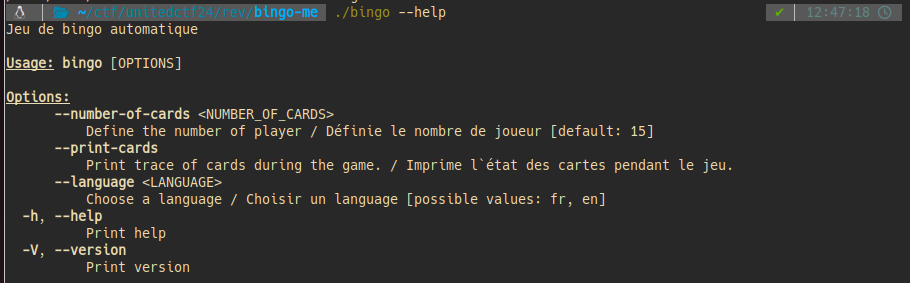
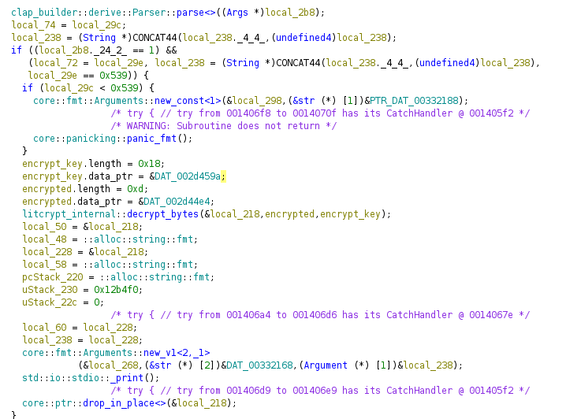
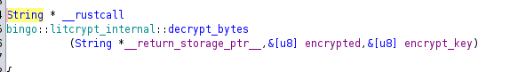
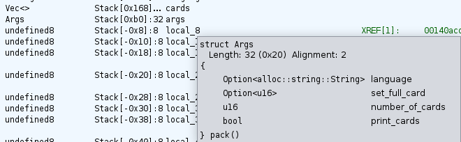
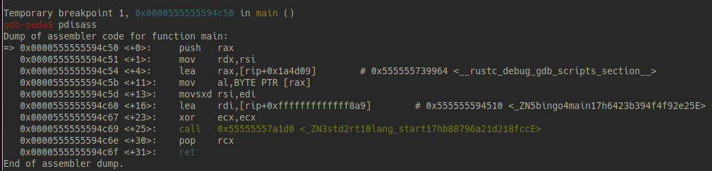
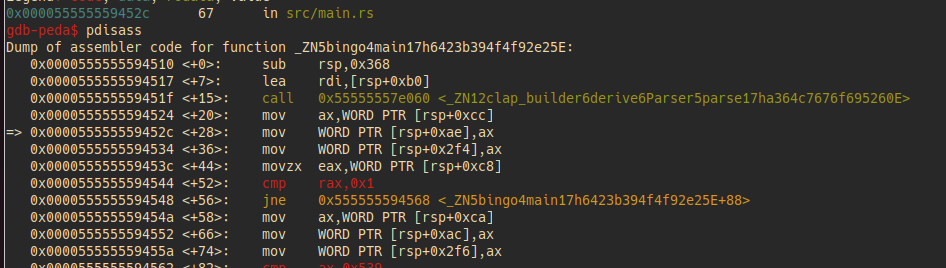
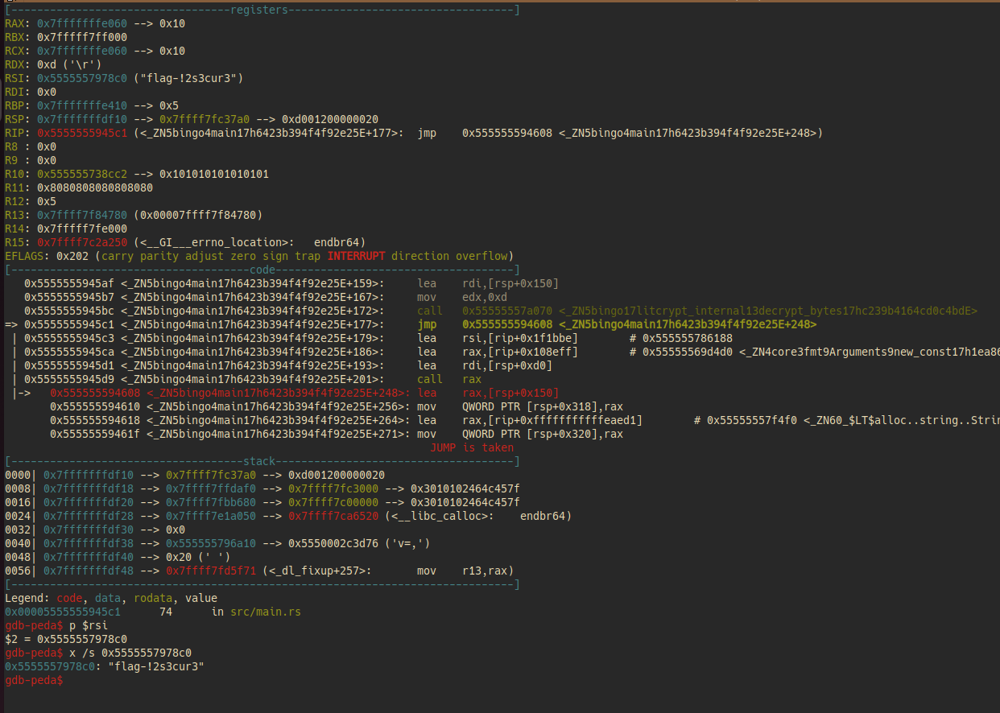

# Bingo - 7 points
Play with flags to get the flag.

Hint: The --help may not always tell the truth.

## Bingo Program
Bingo is a program written in Rust that uses the clap crate to parse its arguments.



## Static analysis with Ghidra
After inspecting the decompiled main function code in Ghidra (for some hours), we notice this weird call to `litcrypt_internal::decrypt_bytes()`.



`litcrypt_internal::decrypt_bytes()` signature in Ghidra:


Inspecting further reveals a hidden argument we can pass to the program



## Dynamic analysis with GDB
We want to break on the if statement at line 74, translated to the `cmp rax,0x1` instruction, to inspect the value of the rax register in different cases. Since my understanding of Rust binary isn't very deep, I had trouble finding the instruction address but managed to follow addresses and find it.



GDB tells me the address of `_ZN5bingo4main17h6423b394f4f92e25E` which is `0x555555594510` at main+16

We eventually find the address for the comparison instruction which is `0x555555594544`


Testing further reveals that the `--set-full-card` option needs to be active to step in the if statement.

Also, its value needs to be `0x500`

## Solution

From there, we just need to inspect the value of the the first argument of `litcrypt_internal::decrypt_bytes()`, named `__return_storage_ptr__` by Ghidra, when the function returns. This value will be in the rsi register as of the 64 bit x86 calling convention.

We also need to set the number of bingo cards to greater or equal to `0x500` otherwise the program panics.



## Flag
flag-!2s3cur3

## Script used to automate dynamic analysis
```python
from pwn import *

io = process('bingo')

start_script = 'start --set-full-card 1337 --number-of-cards 1337\nb *0x0000555555594544\nc\nb *0x5555555945bc\nc\n'

gdb.attach(io, start_script)
```
