# Reverse me!
Running the program gives us `Unauthorized access detected, shutting down...`
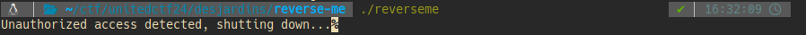
## Challenge 1 - 2 points
With summer coming to an end, this is our last chance to make money before the harsh dryness of winter. No one wants to miss out on this final lucrative period, especially not because of ransomware...

Well... I shouldn't have spoken too soon...

A mysterious binary was discovered on the administration's computer. It's a debugging program left behind by the attacker, which might help recover the affected files.

As a tech prodigy, you must find the secret keys hidden within.
Good luck !

## Solution
Upon opening the 32-bit binary in Ghidra (our favorite disassembler) and looking at the C-like disassembly code, we find this function, that I renamed `main`:

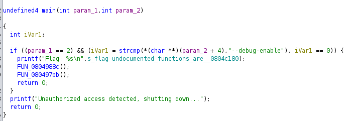

At line 7 we see that the program expects the `--debug-enable` argument, otherwise it exits. We can find the 1st flag hardcoded or run the program with the expected argument

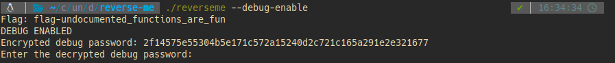

## Flag 1
flag-undocumented_functions_are_fun

## Challenge 2 - 5 points
Time is money, the park administration tells you! But you know that there's no point in rushing; you need to start on time!

The task is simple: open in debug mode and see what happens!

... oh no!

Debug mode requires a password to continue :(

## Solution
We have an encrypted password `2f14575e55304b5e171c572a15240d2c721c165a291e2e321677` which we need to decrypt to continue

Investigating further in Ghidra reveals this piece of code

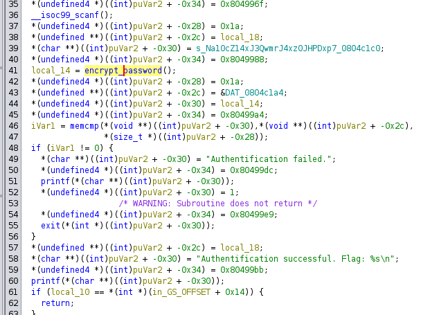

Our win condition for printing the next flag is that the `memcmp` function needs to return 0. We can see that it compares the value of the `local_14` variable which was pushed on the stack with an offset of `-0x30` to some other variabel in memory. `local_14` (the encrypted password) is the returned value of the function of interest, which I renamed `encrypt_password`

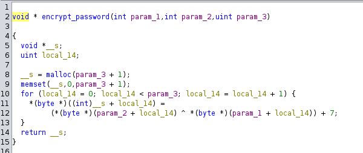

The arguments to the `encrypt_password` function are a string constant hard-coded in the program equal to `"Na10cZ14xJ3QwmrJ4xz0JHPDxp7`, our input and lastly the length of the password which is `0x1a`

The following script reverses the `encrypt_password` function:
```python
from pwn import *

io = process(['reverseme', '--debug-enable'])

enc = '2f14575e55304b5e171c572a15240d2c721c165a291e2e321677'
enc_hex = [0x2f, 0x14, 0x57, 0x5e, 0x55, 0x30, 0x4b, 0x5e, 0x17, 0x1c, 0x57, 0x2a, 0x15, 0x24, 0x0d, 0x2c, 0x72, 0x1c, 0x16, 0x5a, 0x29, 0x1e, 0x2e, 0x32, 0x16, 0x77]
v = 'Na10cZ14xJ3QwmrJ4xz0JHPDxp7'
len = 26

flag = ''
for i in range(len):
    enc_hex[i] -= 7
    res = (ord(v[i]) ^ enc_hex[i])
    flag += chr(res)

io.recv() 
io.sendline(flag.encode())
io.recv()
io.interactive()
```

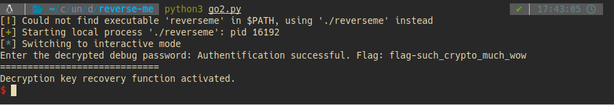

## Flag 2
flag-such_crypto_much_wow

## Challenge 3 - 5 points
Before you can obtain the final decryption key, you will need to show creativity to solve the input of a function with complex logic.
Good luck!

This clown will have shown you all the colors!

## Solution
We now need to find the admin password
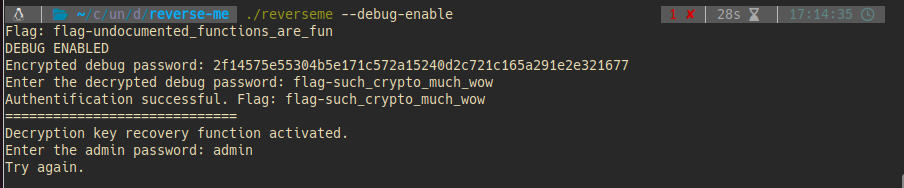

We see that the result of the `build_admin_password` function should be `nndrdylrsmvzswybaxlul`
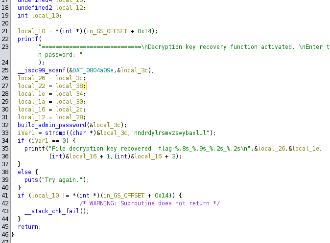

The function of interest:
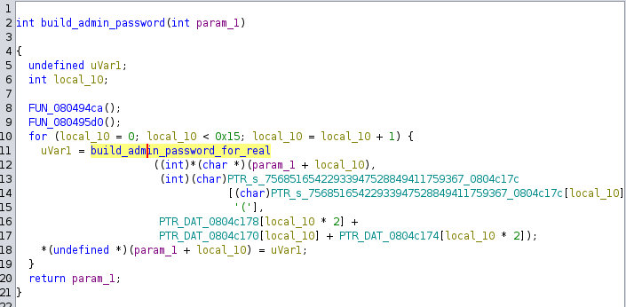

The function to reverse:
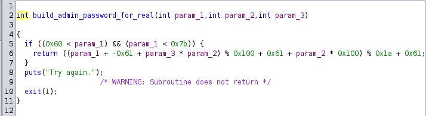

To reverse the function, where the first argument is our input, we need to know what are the values of the second and third arguments. For this, we will use GDB

This was a pain since the binary is stripped but I managed to find the instruction address where the `build_admin_password_for_real` function is called and added a breakpoint there to inspect the arguments values
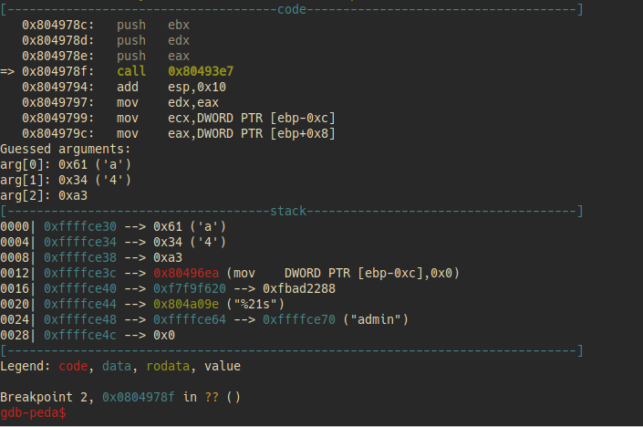


The following script reverses the `build_admin_password_for_real` function:
```py
from pwn import *

flag2 = 'flag-such_crypto_much_wow'

io = process(['reverseme', '--debug-enable'])
io.recv() 
io.sendline(flag2.encode())
io.recv()

res = 'nndrdylrsmvzswybaxlul'
p2 = ['4','3','9','7','3','2','9', '3', '3', '2', '2','5','9','9','5','3', '4','3','2','7', '7']
p3 = [0xa3,0xa2,0xa2,0x97,0xa2,0x9e,0xa0,0x9a,0x9f,0x9d,0x9c,0xa2,0x9f,0xa0,0x9f,0xa0,0x9b,0x92,0x99,0x9b,0x9f]
flag3 = ''
len = 21
alpha = list(string.ascii_letters)

for i in range(21):
    for c in alpha:
        if ((ord(c) - 0x61 + p3[i] * ord(p2[i])) % 0x100 + 0x61 + ord(p2[i]) * 0x100) % 0x1a + 0x61 == ord(res[i]):
            flag3 += c
            break

# fix because we are getting 'symbolicexecutionesop' while 'symbolicexecutionisop' is the right password
flag3 = flag3[:17] + 'i' + flag3[18:]
print(flag3)
io.sendline(flag3.encode())
io.interactive()
```
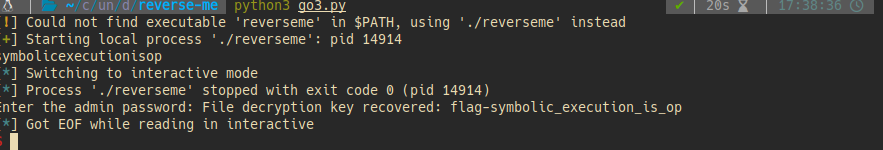

## Flag 3
flag-symbolic_execution_is_op
